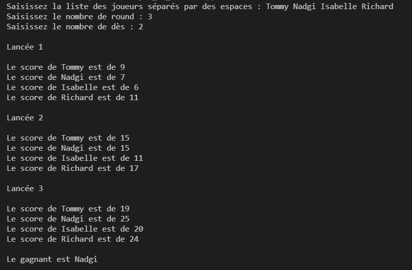

## Jeu de dés

Voici la livraison MVP du programme python de jeu de dés.

Ce programme demande la liste des joueurs séparés par un espace, il demande ensuite le nombre de tours et enfin le nombre de dès.

A l'issue du lancement, il affiche les différents scores des joueurs au fil du lancer et affiche le gagnant

